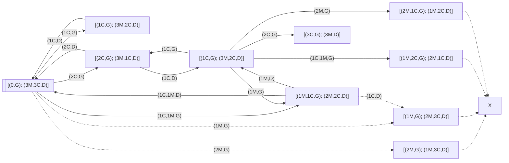
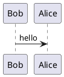

# Modélisation et Formulation de problèmes de recherche
---
<!-- Chargement de KaTeX et Mermaid -->
<link rel="stylesheet" href="https://cdn.jsdelivr.net/npm/katex@0.16.9/dist/katex.min.css">
<script defer src="https://cdn.jsdelivr.net/npm/katex@0.16.9/dist/katex.min.js"></script>
<script defer src="https://cdn.jsdelivr.net/npm/katex@0.16.9/dist/contrib/auto-render.min.js"
        onload="renderMathInElement(document.body);"></script>

<script type="module">
import mermaid from 'https://cdn.jsdelivr.net/npm/mermaid@10/dist/mermaid.esm.min.mjs';
mermaid.initialize({ startOnLoad: true });
</script>
<!-- $$ -->

## Exercice 1: *Problème des Missionnaires et Cannibales*

>a. Modélisation du problème

Soit les lettres M et C représentants respectivement missionnaires et cannibales
Soit G et D (gauches et droites)

- *Espace des états*:   
    - 3 missionnaires sur la rive G et 3 cannibales sur la rive D, et inversement;  <!-- $ 2 states $ -->
    - tous les missionnaires et cannibales sur l'une des rives (G ou D);    <!-- $ 2 states $ -->
    - 3 missionnaires sur la rive G et 1 ou 2 cannibale(s) sur la rive D, et inversement;   <!-- $ 2 states $ -->

- *Actions possibles*:  
    - Embarquer uniquement à deux dont: 2 M; 2 C; 1 M et 1 C;
    - Embarquer une personne dont: 1 M; 1 C;

- *Description des transitions d'états*:    

    Avec la configuration 3 M et 3 C sur la rive G ou D ( **[M, M, M, C, C, C, D]** ou **[M, M, M, C, C, C, G]** )

    - Soit 
    - 

- *Critère d'optimalité*:   
    - Faire traverser deux cannibales en premier


>b. Représentation sous forme de graphe

*Informations sur le graphe*:   Soit 
- [(*rive gauche*); (*rive droite*)]    ->  [(..., $G$); (..., $D$)]
- $M_g$ et $M_d$ respectivement missionnaire(s) étant à gauche et à droite
- $C_g$ et $C_d$ respectivement cannibale(s) étant à gauche et à droite
- $\vec{G}$ et $\vec{D}$ respectivement aller en direction de la gauche et droite
- ex.: relations    ($2M_d$, $\vec{G}$) et  ($1M_g$, $1C_g$, $\vec{D}$)

<!--
```mermaid
graph TD;
```
-->
<!-- A[["[(0,G); (3M,3C,D)]"]] --|>|"<span>(1C,G)</span>"| A; -->



---

## Exercice 2: *Un jeu de séduction*

>1.1. Formulation du problème de recherche:

- *Etats Initiaux*: 
    - *e1*: **[M, M, M, [V], F, F, F]**
    - *e2*: 

- *Actions possibles*:  
    - ***act1***: Une personne (homme ou femme) peut aller sur une chaise vide adjacente.

    - ***act2***: Une personne peut sauter une ou deux personnes pour aller sur une chaise vide.

- *Objectifs de test*:  
    - Mettre des femmes et hommes côte à côte : **[..., M, F, ...]**
    - Obtenir la configuration **[[V], M, F, M, F, M, F]**

- *Coûts des actions*:  
    - *act1*: coût = **1**

    - *act2*: 
        - **1** ->  1 déplacement;
        - **2** ->  2 déplacements;

>1.2. Deux autres configurations pour l'état final:

- Configuration 1:  **[M, F, M, F, M, F, [V]]**


- Configuration 2:  **[M, F, F, M, M, F, [V]]**


---


<!--
{ [(M, M, M, C, C, C, G); ()] | } { __(2C_<>)__>{ { [(M, M, M, C, G); (C, C, D)] | } { || { [(); ()] | } {  __()__>  { [(); ()] | }

---
m f m m v f f

- m f m f m f v

- m f f m m f v
---
- direction de la barque
- nbr de missionnaires ou cannibales sur A et/ou B
-->
---
<!--
# UML example


-->
<!--
Here is a simple flow chart:

```mermaid
graph TD;
    A--|>B;
    A--|>C;
    B--|>D;
    C--|>D;
```
-->
<!--
```stl
solid cube_corner
  facet normal 0.0 -1.0 0.0
    outer loop
      vertex 0.0 0.0 0.0
      vertex 1.0 0.0 0.0
      vertex 0.0 0.0 1.0
    endloop
  endfacet
  facet normal 0.0 0.0 -1.0
    outer loop
      vertex 0.0 0.0 0.0
      vertex 0.0 1.0 0.0
      vertex 1.0 0.0 0.0
    endloop
  endfacet
  facet normal -1.0 0.0 0.0
    outer loop
      vertex 0.0 0.0 0.0
      vertex 0.0 0.0 1.0
      vertex 0.0 1.0 0.0
    endloop
  endfacet
  facet normal 0.577 0.577 0.577
    outer loop
      vertex 1.0 0.0 0.0
      vertex 0.0 1.0 0.0
      vertex 0.0 0.0 1.0
    endloop
  endfacet
endsolid
```
-->
