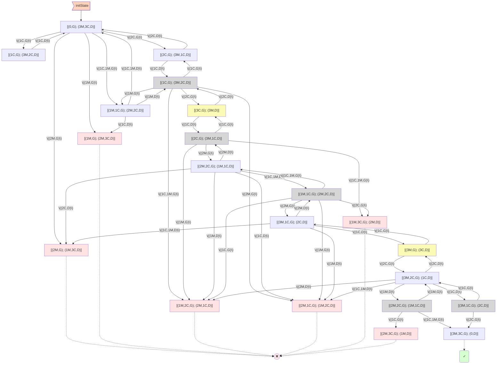
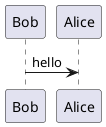

# Modélisation et Formulation de problèmes de recherche
---
<!-- Chargement de KaTeX et Mermaid -->
<link rel="stylesheet" href="https://cdn.jsdelivr.net/npm/katex@0.16.9/dist/katex.min.css">
<script defer src="https://cdn.jsdelivr.net/npm/katex@0.16.9/dist/katex.min.js"></script>
<script defer src="https://cdn.jsdelivr.net/npm/katex@0.16.9/dist/contrib/auto-render.min.js"
        onload="renderMathInElement(document.body);"></script>

<script type="module">
  import mermaid from 'https://cdn.jsdelivr.net/npm/mermaid@10/dist/mermaid.esm.min.mjs';
  mermaid.initialize({ startOnLoad: true });
</script>
<!-- $$ -->


### Exercice 1: *Problème des Missionnaires et Cannibales*

>a. Modélisation du problème

```text
- Soit les lettres M et C représentants respectivement les missionnaires et cannibales
- Soit G et D (les positions gauches et droites)
```

- *Espace des états*:   
    - 3 missionnaires sur la rive G et 3 cannibales sur la rive D, et inversement;  <!-- $ 2 states $ -->
    - tous les missionnaires et cannibales sur l'une des rives (G ou D);    <!-- $ 2 states $ -->
    - 3 missionnaires sur la rive G et 1 ou 2 cannibale(s) sur la rive D, et inversement;   <!-- $ 2 states $ -->
    - Une barque vide positionnée au niveau des premiers passagers

- *Actions possibles*: - Embarquer au plus deux personnes dont: 2 M; 2 C; 1 M et 1 C; 1 M; 1 C;

- *Objectif(s)*: - Faire traverser tous (cannibales et missionnaires) vers l'autre rive

- *Coûts des actions* (aléatoires):
  - Toute action minimisant les traversées vaudrait 1, autrement 0;
  - Le non respect de la condition ($nbrMissionnaires \ge nbrCannibales$) annule tout les coûts ($c = 0$), et une réussite est de 1 (finaliser la mission);

- *Description des transitions d'états*:    
    - Le nombre de missionnaires ou de cannibales varie entre 0 et 3 sur les deux rives
    - Un retour de la barque, sur une rive, implique toujours d'avoir un conducteur <!-- nautonier -->
    - Sur l'une des rives, un nombre supérieur de cannibale ($nCa > nMiss$) implique une perte de points du à une mauvaise combinaison

- *Critère d'optimalité*:   Minimiser le nombre de traversée
  - Constraintes:
>> - $MAX(PB = m + c)$
>> - $m + c \le 2$
>> - $m, c \in \{0, 1, 2\}$
>> - $m_{G,D} \ge c_{G,D}$
>> - avec $PB$ le nombre de personne dans la barque, m et c respectivement le nombre de $missionnaires$ et de $cannibales$, $m_{G,D}$ et $c_{G,D}$ $missionnaires$ et $cannibales$ sur la rive $G$ et/ou $D$.

  - - Critère:
>> - $MIN(NT = PB)$
>> - avec $NT$ le nombre de traversée.


>b. Représentation sous forme de graphe

*Informations sur le graphe*: 
- [(*etat rive gauche*); (*etat rive droite*)]    $->$  [(..., $G$); (..., $D$)];
<!--- $M_g$ et $M_d$ respectivement missionnaire(s) étant (avant l'action) à gauche et à droite;-->
<!--- $C_g$ et $C_d$ respectivement cannibale(s) étant (avant l'action) à gauche et à droite;-->
- $\vec{G}$ et $\vec{D}$ respectivement barque chargée allant en direction de la gauche et droite (pour les relations - transitions);
    - ex.: relations    ($2M$, $\vec{G}$) et  ($1M$, $1C$, $\vec{D}$)

---
<!--
```mermaid
graph TD;
```
-->
<!-- A[["[(0,G); (3M,3C,D)]"]] --|>|"<span>(1C,G)</span>"| A; B & C -.-> X[X];-->



---
---

### Exercice 2: *Un jeu de séduction*

>1.1. Formulation du problème de recherche:

- *Etats Initial / Initiaux*: 
    - *e1*: **[M, M, M, [V], F, F, F]**
    - *e2*: 

- *Actions possibles*:  
    - ***act1***: Une personne (homme ou femme) peut aller sur une chaise vide adjacente.

    - ***act2***: Une personne peut sauter une ou deux personnes pour aller sur une chaise vide.

- *Objectifs de test*:  
    - Mettre des femmes et hommes côte à côte : **[..., M, F, ...]**
    - Obtenir la configuration **[[V], M, F, M, F, M, F]**

- *Coûts des actions*:  
    - *act1*: coût = **1**

    - *act2*: 
        - **1** ->  1 déplacement;
        - **2** ->  2 déplacements;

>1.2. Deux autres configurations pour l'état final:

- Configuration 1:  **[M, F, M, F, M, F, [V]]**

- Configuration 2:  **[M, F, F, M, M, F, [V]]**


---

###

<!--
{ [(M, M, M, C, C, C, G); ()] | } { __(2C_<>)__>{ { [(M, M, M, C, G); (C, C, D)] | } { || { [(); ()] | } {  __()__>  { [(); ()] | }

---
m f m m v f f

- m f m f m f v

- m f f m m f v
---
- direction de la barque
- nbr de missionnaires ou cannibales sur A et/ou B
-->

<!--
# UML example


-->
<!--
Here is a simple flow chart:

```mermaid
graph TD;
    A--|>B;
    A--|>C;
    B--|>D;
    C--|>D;
```
-->
<!--
```stl
solid cube_corner
  facet normal 0.0 -1.0 0.0
    outer loop
      vertex 0.0 0.0 0.0
      vertex 1.0 0.0 0.0
      vertex 0.0 0.0 1.0
    endloop
  endfacet
  facet normal 0.0 0.0 -1.0
    outer loop
      vertex 0.0 0.0 0.0
      vertex 0.0 1.0 0.0
      vertex 1.0 0.0 0.0
    endloop
  endfacet
  facet normal -1.0 0.0 0.0
    outer loop
      vertex 0.0 0.0 0.0
      vertex 0.0 0.0 1.0
      vertex 0.0 1.0 0.0
    endloop
  endfacet
  facet normal 0.577 0.577 0.577
    outer loop
      vertex 1.0 0.0 0.0
      vertex 0.0 1.0 0.0
      vertex 0.0 0.0 1.0
    endloop
  endfacet
endsolid
```
-->
<!--
```mermaid
sequenceDiagram
    participant Alice
    participant Bob
    Alice->>Bob: Bonjour Bob, comment ça va?
    Bob--|>>Alice: Ça va bien, merci!
```
-->
<!--
```mermaid
graph TD
    Start([Démarrage du processus])
    Decision{Décision importante ?}
    Process1>Étape 1]
    Process2>Étape 2]
    End((Fin))

    Start --|> Decision
    Decision --|>|Oui| Process1
    Decision --|>|Non| Process2
    Process1 --|> End
    Process2 --|> End
```
-->

<!---->

